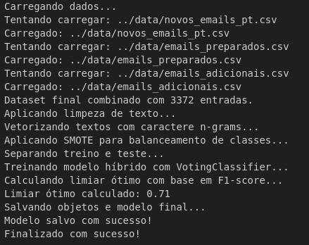
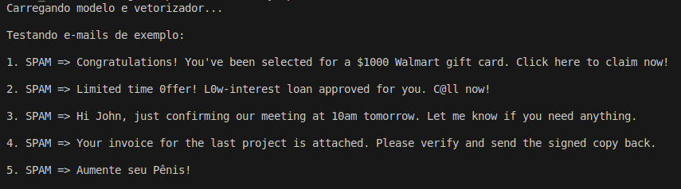
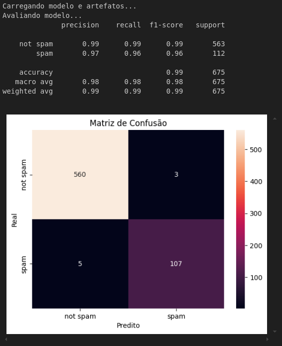

# 📬 Classificador de Spam com Aprendizado de Máquina

Este projeto utiliza técnicas de Machine Learning para treinar um modelo de classificação de e-mails como **spam** ou **não spam**, com alta acurácia e interpretabilidade. Ele foi treinado com base no corpus do [SpamAssassin Public Corpus](https://spamassassin.apache.org/publiccorpus/) e enriquecido com exemplos adicionais em português.


## ⚙️ Passos para Execução

### 1. Preparação do ambiente
- Baixe os arquivos de spam e ham do SpamAssassin.
- Extraia manualmente os `.tar.bz2` para os diretórios correspondentes:
  - `*_easy_ham.tar.bz2` → `easy_ham/`
  - `*_hard_ham.tar.bz2` → `hard_ham/`
  - `*_spam.tar.bz2` → `spam/`

- Crie um ambiente virtual:
Recomendo executar em um ambiente (environment)

```
sudo apt install python3-venv
```
```
python -m venv env
```
```
source env/bin/activate
```
```
pip install requirements.txt
```

### 2. Geração de dados
- Execute o script para gerar emails_preparados.csv:
```
python analisa_dados_e_gera_dataframe.py
```
- Adicione, se desejar, outros CSVs com colunas *subject*, *body*, *label* na pasta ./data

### 3. Treinamento do modelo
- Abra o Jupyter Notebook com o ambiente virtual ativado:

```
jupyter notebook
```

- Execute o notebook notebooks/<b>treinar.ipynb</b>:

    - Treina o modelo híbrido
    - Aplica SMOTE
    - Calcula e salva o threshold ótimo
    - Salva o vetorizador TF-IDF, vetores X/y e o modelo final

<p align="center">
  
</p>

### 4. Avaliação do modelo
- Execute o notebook notebooks/<b>avaliar.ipynb</b>:

    - Carrega os vetores e o modelo salvo
    - Gera relatório de classificação e matriz de confusão
    - Permite ajustar ou testar diferentes thresholds

### 5. Teste em e-mails simulados
- Execute o script:
```
python src/testa_modelo.py
```
<p align="center">
  
</p>

### Resultados
- O modelo atinge excelente desempenho:
    - Acurácia: 99%
    - Precisão SPAM: 97%
    - Recall SPAM: 96%

<p align="center">
  
</p>
